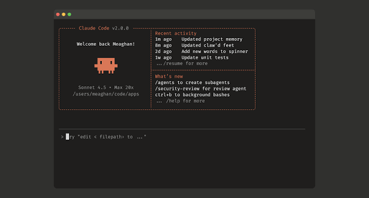

# DocMind AI 🧠

**An Offline Multimodal AI Agent for Intelligent PDF Understanding and Knowledge Retrieval**

DocMind AI is a fully local, offline, multimodal AI Agent designed to understand, search, analyze, and reason over documents containing text, scanned pages, images, tables, charts, and diagrams — all without requiring an internet connection.



---

## 📖 What is this?

Unlike a conventional PDF chatbot that follows a simple "Question → Search → Answer" workflow, DocMind uses an **agentic architecture**. When you ask a question, the DocMind Agent autonomously determines what actions are required to arrive at a verified answer. 

The entire AI pipeline is designed to run **locally on your computer**, ensuring 100% privacy and avoiding external cloud API costs.

### Key Capabilities:
- Read normal PDF text and Office documents (DOCX, PPTX, XLSX).
- Process scanned documents using local OCR.
- Extract and analyze images (multimodal vision support).
- Understand tables, charts, and diagrams.
- Perform semantic retrieval across multiple documents.
- Execute multi-step reasoning to combine evidence from different pages.
- Ground answers in verifiable evidence with citations.

---

## ✨ Features

- **Agentic Pipeline**: Plans queries, executes sub-searches, performs visual analysis, reasons over retrieved context, and verifies the final answer.
- **Interactive Terminal UI**: A sleek, dark, hacker-style terminal interface with built-in slash commands (`/upload`, `/ask`, `/summarize`, `/clear`, `/help`).
- **AI Brain Visualization**: A dedicated "AI Brain" tab featuring a real-time, procedural neural-network animation driven by live WebSocket events from the backend Agent (displaying states like *Searching*, *Reasoning*, and *Verifying*).
- **Zero-Latency Commands**: Instant frontend/backend responses for built-in system commands.
- **Completely Offline**: Powered by local embeddings, local OCR engines, and local LLMs.
- **Drag & Drop**: Seamlessly drop files into the terminal window to index them into the local vector database.

---

## 📂 Phase Documentation Files (Markdown)

This repository contains several `.md` files that represent the different phases of design, architecture, and feature planning for the project. 

Here is a guide to understanding them:

* **`DocMind.md`**
  The core project foundation. This file contains the primary problem statement, proposed solution, high-level system architecture, and overall goals for building an offline multimodal document agent.
  
* **`DocMind_Terminal_UI_Spec.md`**
  The UI/UX design document. It details the transition to the dark, retro-terminal aesthetic, specifying color palettes (amber/orange accents), layout mechanics, slash command behaviors, and the overall "hacker" visual identity.

* **`DocMind_AI_Brain_Guide.md`**
  The feature specification for the "AI Brain" tab. It breaks down the procedural HTML canvas animation, the mapping of agent states (e.g., *idle*, *reasoning*, *vision*), the visual activity levels, and the WebSocket architecture required to stream real-time agent thoughts to the UI.

* **`buildGuide.md`**
  Technical documentation and implementation guidelines for setting up the local environment, running the Python FastAPI backend, and running the React/Vite frontend.

* **`newChanges.md` & `ui.md`**
  Development scratchpads and changelogs detailing iterative adjustments to markdown rendering, layout styling, and component behaviors during development sprints.

---

## 🚀 Tech Stack

**Frontend:**
- React (Vite)
- TypeScript
- HTML Canvas (for procedural animations)
- Vanilla CSS (Terminal UI styling)

**Backend:**
- Python (FastAPI)
- WebSockets (for real-time Agent streaming)
- PyMuPDF / Tesseract (OCR & PDF processing)
- Local Vector Store & Embeddings
- Local LLM / Vision integrations

---

## 💻 Getting Started

### 1. Start the Backend
Navigate to the backend directory, activate your virtual environment, and start the FastAPI server:
```bash
source .venv/bin/activate
uvicorn backend.api.main:app --host localhost --port 8000 --reload
```

### 2. Start the Frontend
In a new terminal, navigate to the frontend directory and start Vite:
```bash
cd frontend
npm install
npm run dev
```

Open `http://localhost:5173` in your browser. Type `/upload` to add a document, and watch the AI Brain tab come to life when you ask it a question!
